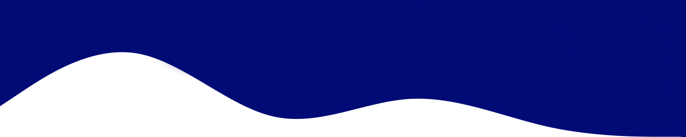

Hi there, thanks for stopping by, this is **CNbysec**.


```go
package main

type Me struct{
  Pronouns string
  Code string
  Job string
  BestAndFavoriteSkill string
}

func main() {
  me := &Me{
    Job: "渗透测试工程师，自动化赏金技巧分享，开源共享让世界更美好",
    Pronouns: "He/Him",
    Code: "PHP and Python and Go Everythings",
    BestAndFavoriteSkill: "Web Hacking and App Hacking :D"
  }
  _ = me
}

```


<a href="https://github.com/CNbysec">
  
</a>
<a href="https://github.com/CNbysec">
   
</a>


---

⭐️ From [@CNbysec](https://github.com/CNbysec)
